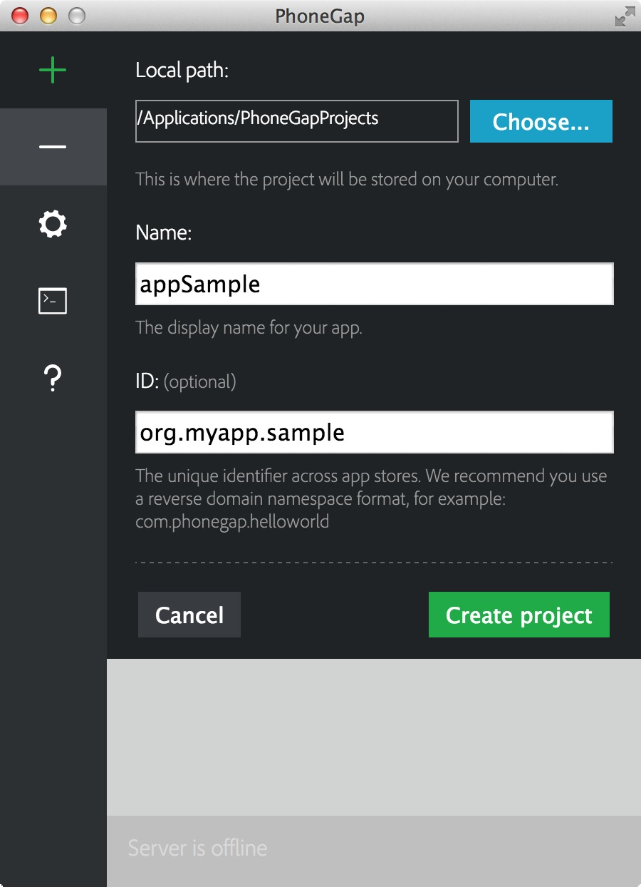

<link href="../css/styles.css" rel="stylesheet">
<link href="../css/bootstrap.css" rel="stylesheet">

##Step 3: Create a PhoneGap Project

Now let's get our feet wet and create our first PhoneGap project. This project will become a mobile app with the ability to run on multiple devices and across operating systems with just a few simple steps.

####Default Hello World
The PhoneGap desktop tools include a default Hello World project for beginners to start with. It's proven to be the quickest and easiest way to understand the basics of building a mobile PhoneGap app so let's start there:

1. Click the plus sign and select Create new PhoneGap project as shown below:

	
2. You will be presented with a screen to enter information about your project. Enter the path on your local hard drive to create the project, a designated name and optional *identifier*. 

      
 
	
**NOTE:** Be aware that the ID field is also known as the *package identifier* for Android and the *bundle identifier* for iOS.

	Once the information has been entered, click the green *Create project* button.

3.  You should now see a view like below, with your new project shown and a green play button next to it. Also note the green bar at the bottom with a server address, we'll need this in our next step. 

      

Congratulations! You've created your own uniquely named version of the default PhoneGap Hello World project. In the next step we'll learn how we can make it available for preview by the PhoneGap Developer App on your mobile device with one simple command!

<a href="../install/developer-install.html"><button class="btn-prev"><- Step 2: Install the PhoneGap Developer App</button></a><a href="../run/desktop-serve.html"><button class="btn-next">Step 4: Preview the App -></button></a>