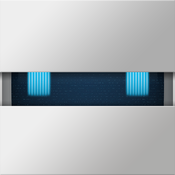
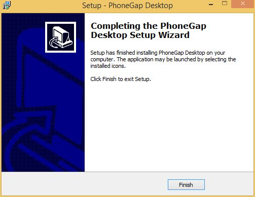

<link href="../css/styles.css" rel="stylesheet">
<link href="../css/bootstrap.css" rel="stylesheet">

## Step 1: Install the PhoneGap Desktop App

Download the installer for your operating system:

- [Mac OSX](https://github.com/phonegap/phonegap-app-desktop/releases/download/0.1.3/PhoneGapDesktop.dmg)	
- [Windows](https://github.com/phonegap/phonegap-app-desktop/releases/download/0.1.3/PhoneGapSetup.exe)

#### Mac OS X Instructions
 
2. Double click the downloaded file to run the installer.
3. Accept the license agreement that is shown as below: 
    
	
4. Move the app to its final location

	On a Mac, drag and drop the PhoneGap app to the Applications folder as shown below:

     

	On Windows, drag the PhoneGap folder to your desired location.
    
5. That's it! Click on the app icon  and get started!

  

#### Windows Installation
2. Double click the downloaded file to run the installer to run the PhoneGap Desktop Setup Wizard. 
    
3. Accept the license agreement: 
    
4. Select the destination to install to:
    
5. Select the start menu folder:
    
6. Click Install to begin the installation:
   
7. Click Finish to close the Setup Wizard. 
   
8. That's it! Click on the app icon  and get started!
  

You're now ready to move on to the next step and create your first mobile app project!

<a href="install-guide.html"><button class="btn-prev"><- Step 0: Choose a Desktop Tool</button></a><a href="developer-install.html"><button class="btn-next">Step 2: Install the Developer App -></button></a>