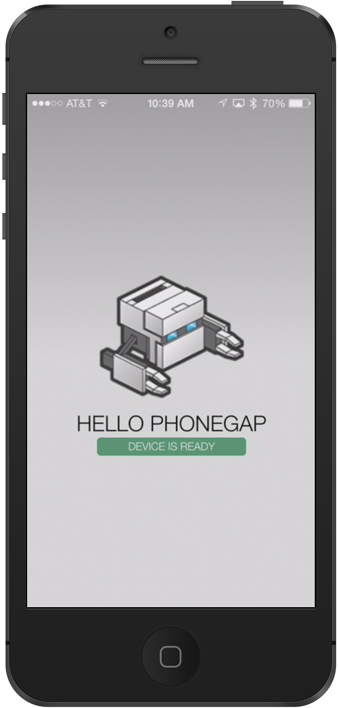

<link href="../css/styles.css" rel="stylesheet">
<link href="../css/bootstrap.css" rel="stylesheet">

## Step 4:  Run your App! 

You can use the *PhoneGap Developer App* paired with the PhoneGap CLI to immediately preview your app on a device without installing platform SDKs, registering devices, or compiling code.

The PhoneGap CLI starts a small web server to host your project and returns the server address for you to use from the PhoneGap Developer App running on your mobile device. 

### Pair and Preview
1. Ensure you are within your project directory created in the previous step and type `$ phonegap serve`. You will receive the server address the app is being hosted on in the output received in the console (`192.168.1.11:3000` in this example): 

		$ phonegap serve
		[phonegap] starting app server...
		[phonegap] listening on 192.168.1.11:3000
		[phonegap]
		[phonegap] ctrl-c to stop the server
		[phonegap]
2. Now go to your mobile device where the PhoneGap Developer App is running, enter the server address on the main screen and tap **Connect**. 
   
 **TIP:** Tap directly on the server address displayed in the terminal screen of the PhoneGap Developer app to change it to match yours. The value shown the first time the app is run is a sample, will default to the last one entered upon next run.

   
    
   
    A connection is created between your mobile device and the computer where the app is running. Once connected, you should see the app running as shown in the second screenshot below:
   
   

   
 **TIP:** Gestures can be used while you're previewing your app. To return to the main screen use a 3-finger tap, to force a refresh of your app use a 4-finger tap.

### Making Updates
3. Now let's make an update to some code to see how easy it is to test a change. Using your favorite text editor, open up the **index.html** file located within the **www** folder of your project; for instance *~/appSample/www/index.html*
 
 **TIP:** Some popular lightweight  but powerful editors include [Brackets](http://brackets.io/), [Sublime Text](http://www.sublimetext.com/) and [Atom] (https://atom.io/). If you're looking for more of an IDE with extensive features and plugins including code hinting and type-ahead, check out [WebStorm by JetBrains](https://www.jetbrains.com/webstorm/)

4. Choose an update to make. Let's start by changing the PHONEGAP text that's displayed in the app from `<h1>PhoneGap</h1>` to `<h1>Hello PhoneGap</h1>`. (This text has a CSS uppercase transform applied to it in the default project). Save it when you're finished and move on to the next step.
  

5. Now check your mobile device where your PhoneGap Developer app is running and you will see your app reload and automatically display the new text!
   
 
 

Continue making updates to your project as desired and get familiar with how it all works. In the next step we'll cover configuring your app.

<a href="../create/cli-create.html"><button class="btn-prev"><- Step 3: Create your App</button></a><a href="../config/config.html"><button class="btn-next">Step 5: Configuration -></button></a>